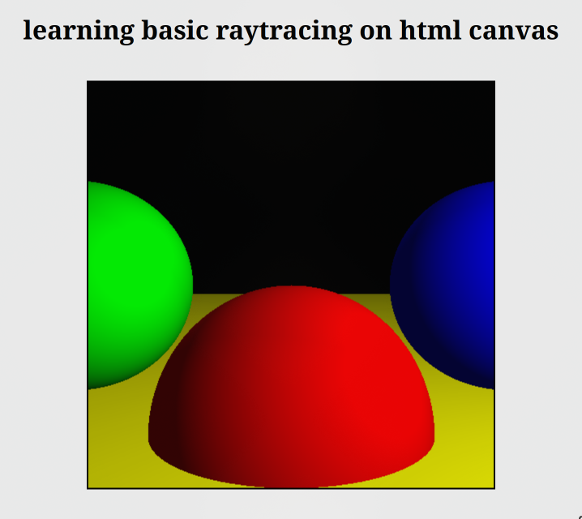

# Raytracer using canvas API

>Render spheres using canvas API

This is a simple project I made to when learning computer graphics this one explores the **Ray tracing algorithm**.

---

## ✨ Features

- Renders spheres.
- point, directional, ambient lights supported.
- diffuse reflection supported
- specular reflection supported
- shadows

---

## Images

  

